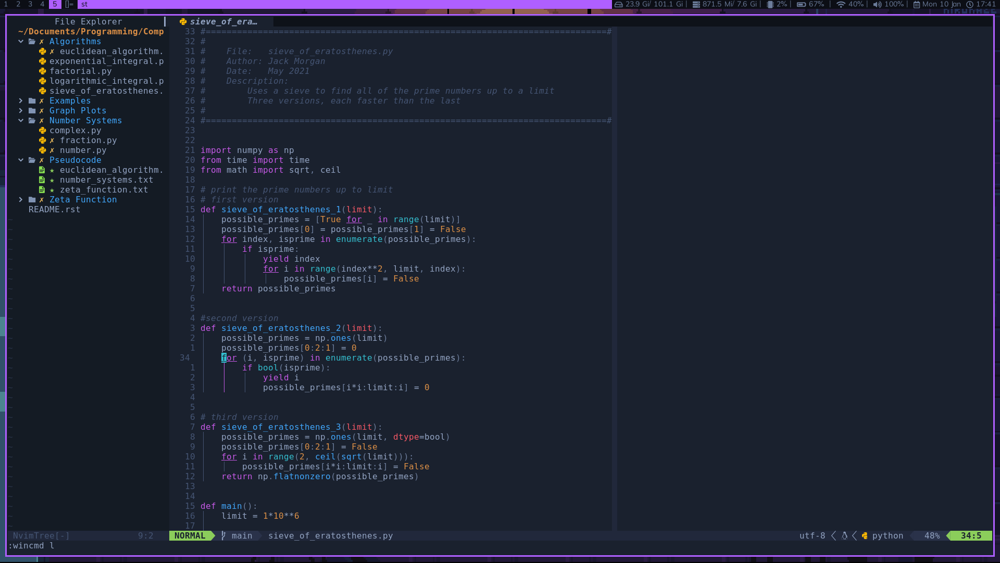
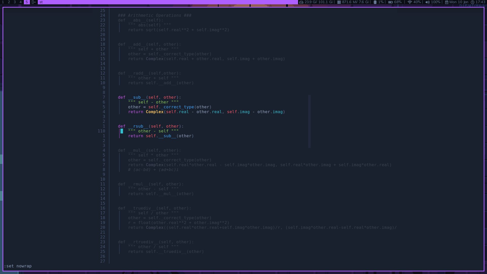

<h1 align="center"> jvim </h1>

<p align="center">
  <a href="https://github.com/jackm245/">
  <a href="https://github.com/jackm245/"></a>
  <a href="https://github.com/jackm245/"></a>
  <a href="https://github.com/jackm245/"></a>
</p>

# jvim
Jack Morgan's Neovim Config

%% 

%% 

## Installation

Dependencies:
 - neovim nightly bin
 - fd
 - ripgrep
 - Python3

Install by running a single command
<br>
``` bash
bash <(curl -s https://raw.githubusercontent.com/jackm245/jvim/master/utils/installer/install.sh)
```

## Contributing

Pull requests are welcome.

## Licence

This software is under the [GPL-3.0](https://choosealicense.com/licenses/gpl-3.0/) licence

